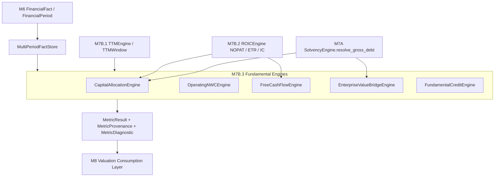
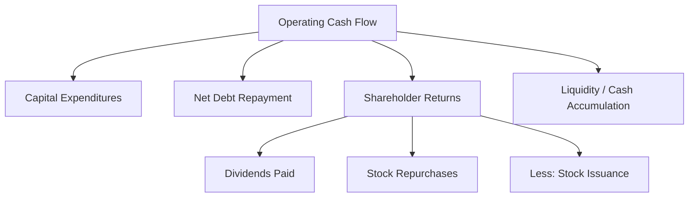
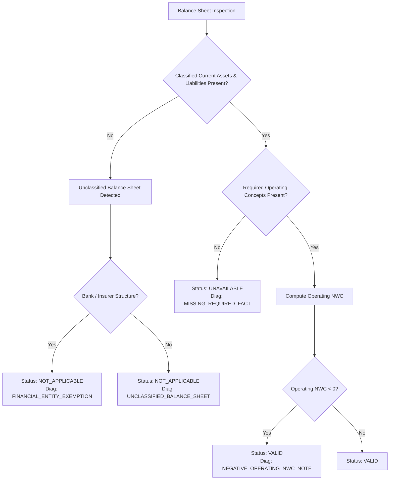
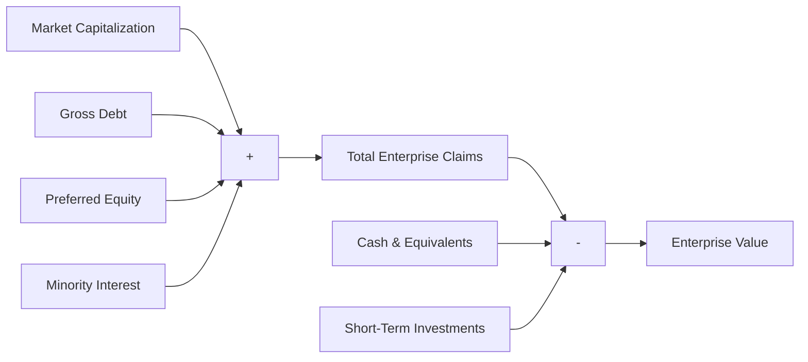
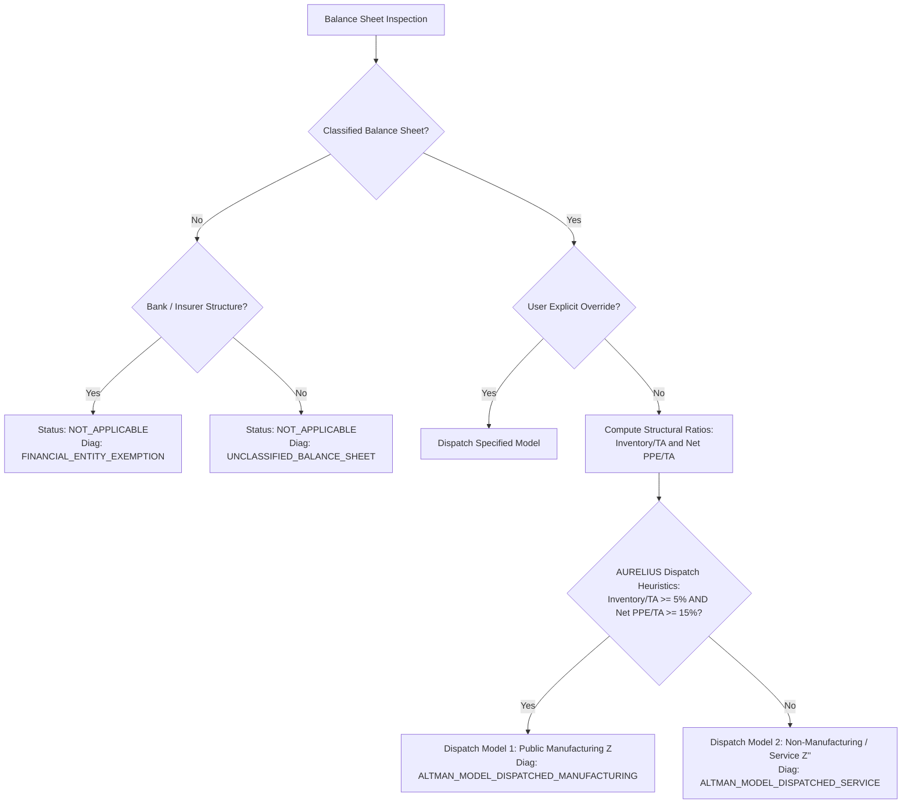
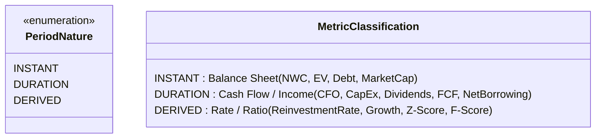

# ARCHITECTURE & METHODOLOGY SPECIFICATION: MILESTONE 7B.3
## Capital Allocation, Non-Cash Working Capital, Cash Flow Reconciliation, Enterprise Value Bridge & Fundamental Credit Diagnostics

---

### DOCUMENT CONTROL
- **Document Identifier**: `docs/architecture/09-m7b3-capital-allocation-cashflow-credit.md`
- **Milestone**: M7B.3 (Final Fundamental Analysis Layer Preceding M8 Valuation)
- **Target HEAD Base**: `2e92878571a04d2ff2a0462aedbefe9f1604f8f8`
- **Specification Status**: **READY** (Incorporating Amendments 1–8)
- **Execution Constraints**: ARCHITECTURE SPECIFICATION ONLY. No source code modifications, no test alterations, no commits, no tags, no push.

---

```
========================================================================================
AURELIUS FINANCIAL & ARCHITECTURAL SPECIFICATION: MILESTONE 7B.3 (AMENDED)
========================================================================================
```

## 1. Executive Summary

Milestone 7B.3 represents the capstone fundamental-analysis layer of the AURELIUS platform. It establishes the bridge between raw financial accounting (M6), core accounting ratios (M7A), TTM sequencing (M7B.1), and operating return decompositions (M7B.2), preparing the system directly for forward-looking valuation in Milestone 8.

The core objective of M7B.3 is to synthesize provider-independent, auditable fundamental metrics spanning:
1. **Capital Allocation & Reinvestment**: Exact tracking of Operating Cash Flow (CFO), Capital Expenditures (CapEx), Shareholder Yield components (Dividends, Repurchases, Share Issuances), and Debt Issuance/Repayment.
2. **Operating Non-Cash Working Capital (NWC) & $\Delta\text{NWC}$**: Rigorous separation of operating current assets/liabilities from financing and cash-equivalent items, with applicability strictly governed by financial-statement structure rather than provider labels.
3. **Free Cash Flow to Firm (FCFF) and Free Cash Flow to Equity (FCFE)**: Canonical unlevered and levered cash-flow formulations with explicit reconciliation between the NOPAT-driven approach and the Cash Flow Statement approach, eliminating double-counting traps and accounting for preferred dividends and exact debt flows.
4. **Fundamental Reinvestment & Sustainable Growth**: Historical observed reinvestment rates and fundamental growth ($g = \text{Reinvestment Rate} \times \text{ROIC}$) strictly bounded as retrospective historical metrics, avoiding forward predictive leakages into M7.
5. **Enterprise Value (EV) Bridge & Capital Structure Weights**: Complete market-value capitalization bridges and debt/equity capital structure weights designed specifically as clean inputs for M8 WACC and valuation multiples, with institutional-grade handling of Preferred Equity and Minority Interest under strict `MISSING ≠ ZERO` rules.
6. **Institutional Fundamental Scoring**:
   - **Piotroski F-Score (9 Signals)**: Faithful implementation of the canonical 2000 academic methodology (including Long-Term Debt to Average Total Assets for F5), paired with a tri-state evaluation model (PASS, FAIL, UNAVAILABLE), explicit AURELIUS zero-debt tie conventions, and coverage reporting that prevents partial scores from being disguised as complete scores.
   - **Altman Z-Score**: Dual-model formulation (Original Manufacturing $Z$ vs. Non-Manufacturing/Service $Z''$) dispatched via objective AURELIUS V1 structural dispatch heuristics (balance-sheet classification, inventory intensity, and plant intensity) rather than third-party metadata.

All metrics adhere to the foundational AURELIUS tenets: **zero plausible fabrication**, **exact Decimal arithmetic**, **full audit provenance**, and **strict temporal period typing**.

---

## 2. Existing Architecture Reuse

Milestone 7B.3 strictly extends and reuses the existing domain primitives established in M6, M7A, M7B.1, and M7B.2 without introducing redundant models or parallel calculation pipelines:



### Reused Architectural Primitives:
- **`FinancialFact` & `FinancialPeriod` (`aurelius.domain.entities.financials`)**:
  - Exact preservation of `PeriodType.INSTANT` for point-in-time balance-sheet observations and `PeriodType.DURATION` for cash-flow/income-statement intervals.
  - Strict preservation of `fiscal_year`, `fiscal_period`, `calendar_year`, and deterministic `period_key`.
- **`MultiPeriodFactStore` (`aurelius.domain.fundamental.period_matching`)**:
  - Primary fact lookup via `get_canonical_fact`, `get_source_fact`, and conflict-checked `get_canonical_fact_checked`.
  - Sequential period navigation via `get_prior_period` for consecutive annual and quarterly comparisons.
- **`TTMEngine` & `TTMWindow` (`aurelius.domain.fundamental.ttm`)**:
  - Aggregation of 4 consecutive compatible quarters for duration metrics.
  - Quarter-end anchor resolution (`resolve_latest_instant_fact`) and multi-period instant pairs (`resolve_instant_pair`).
- **`SolvencyEngine.resolve_gross_debt` (`aurelius.domain.fundamental.engines.solvency`)**:
  - The authoritative 5-tier Gross Debt resolution hierarchy (ST + LT funded debt $\rightarrow$ reported Total Debt $\rightarrow$ LT only $\rightarrow$ ST only $\rightarrow$ missing) is reused without modification.
- **`ROICEngine` (`aurelius.domain.fundamental.engines.roic`)**:
  - Authority on Net Operating Profit After Taxes (NOPAT), Effective Tax Rate (ETR), and Average Invested Capital (IC).
- **Audit Primitives (`aurelius.domain.fundamental.models`)**:
  - All outputs emit standard `MetricResult`, backed by immutable `MetricProvenance` and machine-readable `MetricDiagnostic`.

---

## 3. Scope

### In-Scope (Milestone 7B.3)
1. **Capital Allocation Primitives**: CFO, CapEx, Dividends Paid, Common Stock Repurchases, Common Stock Issuances, Debt Issued, Debt Repaid, Net Debt Issued, Shareholder Yield, Net Shareholder Yield, Buyback Yield, Dividend Yield.
2. **Operating NWC**: Balance-sheet operating current assets, operating current liabilities, Non-Cash Operating Working Capital ($NWC$), and change in working capital ($\Delta NWC$).
3. **Unlevered & Levered Cash Flows**: Canonical FCFF (NOPAT-based), Reconciled FCFF (CFO-based with explicit interest-accrual convention), and FCFE (Equity cash flow deducting preferred dividends and exact debt flows).
4. **Reinvestment Metrics**: Total Reinvestment, Reinvestment Rate, and Historical Fundamental Growth ($g$).
5. **Enterprise Value & Capital Structure**: Market Capitalization bridge, Gross Debt, Preferred Equity, Minority Interest, Cash & Short-Term Investments deduction, Enterprise Value ($EV$), Net Debt, Debt Weight ($W_d$), Equity Weight ($W_e$), and Preferred Weight ($W_p$).
6. **Credit & Distress Diagnostics**:
   - Canonical 9-signal Piotroski F-Score (faithful to 2000 specification) with tri-state signal isolation and partial coverage reporting.
   - Dual-model Altman Z-Score ($Z$ for Manufacturing, $Z''$ for Non-Manufacturing/Services) dispatched via financial-statement structural metrics.
7. **API Endpoints & Serialization**:
   - `GET /api/v1/market/financials/{ticker}/capital-allocation`
   - `GET /api/v1/market/financials/{ticker}/cash-flow-reconciliation`
   - `GET /api/v1/market/financials/{ticker}/credit-scores`
   - `GET /api/v1/market/financials/{ticker}/enterprise-bridge`
8. **Frontend Integration**: Dedicated sub-views within the `AdvancedFundamentalsWorkspace` UI.

### Out-of-Scope (Reserved for Milestone 8)
- Weighted Average Cost of Capital (WACC), Capital Asset Pricing Model (CAPM), Cost of Equity ($K_e$), Cost of Debt ($K_d$).
- Discounted Cash Flow (DCF) models, Gordon Growth Terminal Value, Exit Multiples Terminal Value.
- Forward projections, revenue forecasting, margin normalization curves.
- Multiples valuation engines (P/E, EV/EBITDA, EV/FCFF, P/B relative ranking).
- Target prices, buy/sell/hold ratings, or investment recommendations.

---

## 4. Capital Allocation Methodology

Capital allocation analyzes how corporate management deploys operating cash flow across reinvestment, debt servicing, and shareholder distributions.



### 4.1 Canonical Metric Specifications

| Metric Identifier | Canonical Concept / Source Fallbacks | Period Type | Canonical Sign Convention | Diagnostic Codes |
| :--- | :--- | :--- | :--- | :--- |
| `OPERATING_CASH_FLOW` | `CanonicalConcept.OPERATING_CASH_FLOW` | DURATION | Directional (positive for cash generation, negative for cash burn). | `MISSING_REQUIRED_FACT` |
| `CAPITAL_EXPENDITURES` | `CanonicalConcept.CAPITAL_EXPENDITURES` | DURATION | Positive economic magnitude ($\|CapEx\|$). Provenance retains raw reported sign. | `MISSING_REQUIRED_FACT` |
| `DIVIDENDS_PAID` | `"Cash Dividends Paid"`, `"Common Stock Dividend Paid"`, `"Payment Of Dividends & Other Distributions"` | DURATION | Positive economic outflow magnitude ($\|Div\|$). If firm discloses CF statement but no dividend row, treat as $0$ ONLY if explicitly declared or verified non-payer; otherwise `MISSING_REQUIRED_FACT`. | `MISSING_REQUIRED_FACT` |
| `STOCK_REPURCHASES` | `"Repurchase Of Capital Stock"`, `"Common Stock Payments"`, `"Purchase Of Treasury Stock"` | DURATION | Positive economic outflow magnitude ($\|Repurchase\|$). | `MISSING_REQUIRED_FACT` |
| `STOCK_ISSUANCES` | `"Issuance Of Capital Stock"`, `"Common Stock Issuance"` | DURATION | Positive cash inflow magnitude. | `MISSING_REQUIRED_FACT` |
| `DEBT_ISSUED` | `"Issuance Of Debt"`, `"Long Term Debt Issuance"` | DURATION | Positive cash inflow magnitude. | `MISSING_REQUIRED_FACT` |
| `DEBT_REPAID` | `"Repayment Of Debt"`, `"Long Term Debt Payments"` | DURATION | Positive economic outflow magnitude ($\|Repay\|$). | `MISSING_REQUIRED_FACT` |
| `NET_DEBT_ISSUED` | `DEBT_ISSUED - DEBT_REPAID` (or reported `"Net Issuance Payments Of Debt"`) | DURATION | Directional: Positive = net borrowing; Negative = net debt reduction. | `MISSING_REQUIRED_FACT` |
| `M_AND_A_INVESTMENT` | `"Acquisition Of Business"`, `"Net Business Purchase And Sale"` | DURATION | Positive economic outflow magnitude. Never synthesized if omitted by vendor. | `M_AND_A_DATA_UNAVAILABLE` |

### 4.2 Shareholder Distributions & Yields
All yields represent the ratio of annual or TTM cash distributions relative to the prevailing **Market Capitalization**:

1. **Dividend Yield**:
   $$\text{Dividend Yield} = \frac{\text{Dividends Paid}}{\text{Market Capitalization}}$$
2. **Buyback Yield**:
   $$\text{Buyback Yield} = \frac{\text{Stock Repurchases}}{\text{Market Capitalization}}$$
3. **Gross Shareholder Yield**:
   $$\text{Gross Shareholder Yield} = \frac{\text{Dividends Paid} + \text{Stock Repurchases}}{\text{Market Capitalization}}$$
4. **Net Shareholder Yield (Net Dilution-Adjusted Yield)**:
   $$\text{Net Shareholder Yield} = \frac{\text{Dividends Paid} + \text{Stock Repurchases} - \text{Stock Issuances}}{\text{Market Capitalization}}$$

#### Boundary & Diagnostic Conditions:
- If $\text{Market Capitalization} \le 0$ or is unavailable: Status is `DISTORTED` or `UNAVAILABLE` with diagnostic `MARKET_CAP_UNAVAILABLE` or `NON_POSITIVE_MARKET_CAP`.
- Missing Dividend or Repurchase facts: If either component is missing and cannot be verified as zero, the aggregate yield emits `MetricStatus.UNAVAILABLE` with `MISSING_REQUIRED_FACT`. No silent zero substitution.

---

## 5. Operating Non-Cash Working Capital Methodology

Operating Non-Cash Working Capital ($NWC$) measures the capital required to sustain day-to-day operations, strictly insulating operating liquidity from financing structures and excess cash holdings.

### 5.1 Accounting-Structure Applicability Engine
**Core Principle**: NWC applicability is determined **strictly from financial statement structure and reported accounting concepts**, NEVER from provider sector/industry strings (e.g., Yahoo Finance `"sector"` or `"industry"`).



#### Applicability Rules:
1. **Ordinary Operating Companies (Classified Balance Sheet)**:
   - Balance sheet discloses distinct `CanonicalConcept.CURRENT_ASSETS` and `CanonicalConcept.CURRENT_LIABILITIES`.
   - NWC engine applies fully.
2. **Financial Institutions & Insurers (Unclassified Balance Sheet)**:
   - Financial institutions, commercial banks, insurance carriers, and investment funds do not present classified current assets and liabilities; their balance sheets are ordered strictly by liquidity.
   - Operating NWC is marked `MetricStatus.NOT_APPLICABLE` with diagnostic `FINANCIAL_ENTITY_EXEMPTION` (if statutory banking/insurance items like loans/deposits or policy reserves are detected) or `UNCLASSIFIED_BALANCE_SHEET`.
3. **Missing Required Concepts**:
   - If an operating firm reports a classified statement but is missing either total current assets or total current liabilities due to vendor truncation, the engine emits `MetricStatus.UNAVAILABLE` with diagnostic `MISSING_REQUIRED_FACT`.
4. **Provider Metadata Separation**:
   - Yahoo Finance `sector` or `industry` values are preserved exclusively as display metadata in `provenance.methodology_notes` and UI headers. They have **zero execution authority** in the domain calculation logic.

### 5.2 Balance-Sheet Partitioning & Mathematical Formulation

```
TOTAL CURRENT ASSETS                                TOTAL CURRENT LIABILITIES
┌──────────────────────────────────────┐            ┌──────────────────────────────────────┐
│ Cash & Cash Equivalents              │ EXCLUDED   │ Short-Term Debt / Current Portion LT │ EXCLUDED
│ Short-Term Marketable Investments    │ (Cash)     │ Current Lease Obligations            │ (Debt)
├──────────────────────────────────────┤            ├──────────────────────────────────────┤
│ Accounts Receivable                  │            │ Accounts Payable                     │
│ Inventory                            │ INCLUDED   │ Accrued Operating Expenses           │ INCLUDED
│ Prepaid Expenses & Other Operating   │ (Operating)│ Deferred Revenue / Other Operating   │ (Operating)
└──────────────────────────────────────┘            └──────────────────────────────────────┘
```

$$\text{Operating Current Assets} = \text{Current Assets} - \text{Cash and Cash Equivalents} - \text{Short-Term Investments}$$
$$\text{Operating Current Liabilities} = \text{Current Liabilities} - \text{Short-Term Debt}$$

Where:
- $\text{Short-Term Debt}$ is resolved via `SolvencyEngine.resolve_gross_debt` current-tier components (`"Current Debt"`, `"Current Debt And Capital Lease Obligation"`, `"Current Portion Of Long Term Debt"`).
- If $\text{Short-Term Investments}$ is omitted but `"Cash Cash Equivalents And Short Term Investments"` is reported as a single line item, that composite line item is deducted to ensure no cash equivalents pollute operating assets.

$$\text{Operating } NWC = \text{Operating Current Assets} - \text{Operating Current Liabilities}$$

### 5.3 Negative Operating NWC Preservation
If $\text{Operating Current Liabilities} > \text{Operating Current Assets}$, $NWC$ is negative. This is an economically valid and common phenomenon in highly efficient operating companies (e.g., Apple, Amazon, companies with negative cash conversion cycles funded by vendor credit).
- Status: `MetricStatus.VALID`.
- Diagnostic: `NEGATIVE_OPERATING_NWC_NOTE` ("Negative operating working capital observed: company operations are partially financed by supplier/operating liabilities").

---

## 6. $\Delta\text{NWC}$ Methodology

The change in Non-Cash Operating Working Capital ($\Delta NWC$) governs the cash flow drain or release resulting from operational expansion.

### 6.1 Formula & Temporal Alignment
$$\Delta NWC_t = NWC_t - NWC_{t-1}$$

- **For ANNUAL Statements**:
  $$\Delta NWC_{FY(t)} = NWC_{FY(t)} - NWC_{FY(t-1)}$$
- **For QUARTERLY Statements**:
  $$\Delta NWC_{Q(t)} = NWC_{Q(t)} - NWC_{Q(t-1)}$$
- **For TTM Windows**:
  $$\Delta NWC_{TTM(t)} = NWC_{Q(t)} - NWC_{Q(t-4)}$$
  *Critical TTM Rule*: Because TTM duration cash flows represent the accumulation across 4 consecutive quarters ($12$ months), the associated balance-sheet investment in working capital must span the exact same $12$-month interval, measuring the delta between ending anchor quarter $Q(t)$ and beginning base quarter $Q(t-4)$.

### 6.2 Cash-Flow Interpretation Convention
AURELIUS strictly enforces the economic cash-flow interpretation:
- $\Delta NWC > 0$: **Cash Investment / Cash Drag**. Current operating assets grew faster than operating liabilities, consuming cash. Reduces Free Cash Flow.
- $\Delta NWC < 0$: **Cash Release**. Current operating liabilities grew or assets shrunk, releasing cash. Increases Free Cash Flow.

### 6.3 Diagnostic Handling
- If $NWC_{t-1}$ (or $NWC_{Q(t-4)}$ for TTM) is unavailable due to data history limitations: $\Delta NWC$ is marked `MetricStatus.UNAVAILABLE` with diagnostic `MISSING_PRIOR_PERIOD`.
- Under no circumstances is $NWC_{t-1}$ assumed to be zero.

---

## 7. FCFF Methodology (Free Cash Flow to the Firm)

Free Cash Flow to the Firm ($FCFF$) represents the unlevered, post-tax cash flow generated by operations that is available to all providers of capital (both equity holders and debt claimholders).

### 7.1 Canonical Formulation: NOPAT-Driven (Primary AURELIUS V1)
$$FCFF_{NOPAT} = NOPAT + D\&A - CapEx - \Delta NWC$$

Equivalently:
$$FCFF_{NOPAT} = NOPAT - \text{Reinvestment}$$
Where:
- $NOPAT = EBIT \times (1 - ETR)$, sourced from `ROICEngine.calculate_nopat`.
- $D\&A$: Total Depreciation and Amortization (sourced from Cash Flow statement or Income Statement).
- $CapEx$: Capital Expenditures normalized to positive economic magnitude ($\|CapEx\|$), sourced from `CashFlowEngine.calculate_capital_expenditures`.
- $\Delta NWC$: Change in Non-Cash Operating Working Capital, sourced from `OperatingNWCEngine`.

Methodology Identifier: `FORMULA_FCFF_NOPAT_V1`.

---

### 7.2 Reconciled Formulation: CFO-Driven (Secondary Audit Standard)
Under US GAAP and IFRS indirect cash-flow reporting:
$$CFO = Net\ Income + D\&A - \Delta NWC_{accounting} + \text{Non-Cash Adjustments}$$
And:
$$Net\ Income = EBIT - \text{Interest Expense} - \text{Tax Provision} \pm \text{Non-Operating}$$

Therefore, CFO **already reflects** non-cash D&A addbacks and **already subtracts** the change in working capital!
> **CRITICAL ARCHITECTURAL PROHIBITION**:
> Calculating $FCFF$ as $CFO - CapEx - \Delta NWC$ is mathematically and accounting-wise invalid because it subtracts $\Delta NWC$ twice. AURELIUS explicitly forbids this formula across all engines.

#### The Financing-Cost Treatment & Accrual-Interest Convention:
Corporate finance theory defines unlevered CFO as cash flow from operations before debt financing costs. In corporate disclosures:
1. **Interest Expense vs. Cash Interest Paid**:
   - *Accounting Interest Expense* (Income Statement) reflects accrual financing costs (coupon interest plus/minus bond discount/premium amortization and non-cash accretion).
   - *Cash Interest Paid* (Cash Flow supplemental disclosures / footnotes) reflects actual physical cash disbursed.
   - Under US GAAP (ASC 230), Cash Interest Paid is classified within Operating Cash Flow, meaning CFO is net of cash interest paid. Under IFRS (IAS 7), interest paid may be classified as either operating or financing.
2. **Provider Availability Constraint**:
   - Financial data vendors (specifically Yahoo Finance) standardly expose **Accounting Interest Expense** on the Income Statement or financial breakdown (`"Interest Expense"` / `"Interest Expense Non Operating"`). They do **NOT** reliably expose supplemental Cash Interest Paid as a standardized time-series fact across all tickers.
   - Fabricating a synthetic cash interest paid figure violates AURELIUS core tenets.
3. **AURELIUS V1 Explicit Convention (`FORMULA_FCFF_CFO_ACCRUAL_INTEREST`)**:
   AURELIUS standardizes the CFO-based unlevered cash flow using the **after-tax accounting interest expense add-back**:
   $$FCFF_{CFO} = CFO + [\text{Interest Expense} \times (1 - ETR)] - CapEx$$
   Where:
   - $\text{Interest Expense}$ uses reported Gross Interest Expense (financing cost). If only Net Interest Expense is reported, it uses Net Interest Expense and attaches diagnostic `NET_INTEREST_EXPENSE_FALLBACK`.
   - $ETR$ is the canonical Effective Tax Rate from `ROICEngine`.
   - Treatment of Lease Interest: Under ASC 842 / IFRS 16, interest portions of finance leases are embedded in total interest expense. Adding back total interest expense unlevers both funded debt and finance leases. Operating leases remain operating expenses (reflected in CFO).
   - Non-operating Interest: Interest income from cash/marketable securities is excluded from the add-back (it belongs to non-operating assets in the EV bridge).
   - Diagnostic: System attaches `ACCRUAL_INTEREST_CFO_RECONCILIATION_NOTE` documenting that accrual interest expense serves as the proxy for cash interest paid due to vendor disclosure limits.

### 7.3 Reconciliation Delta & Handling Divergences
The platform computes both metrics where inputs allow:
$$\Delta_{Reconciliation} = FCFF_{NOPAT} - FCFF_{CFO}$$

Divergences arise legitimately due to:
1. **Stock-Based Compensation (SBC)**: Added back in CFO as a non-cash expense, but omitted from NOPAT.
2. **Cash Taxes vs. Tax Provision**: ETR uses Income Statement tax expense, whereas CFO reflects actual cash taxes paid.
3. **Accrual vs. Cash Interest Timing**: Differences between interest incurred and interest paid.
4. **Other Non-Current Operating Items**: Changes in non-current operating provisions reflected in CFO but outside current $NWC$.

When $|\Delta_{Reconciliation}| / |FCFF_{NOPAT}| > 0.15$ ($15\%$), AURELIUS attaches an informative diagnostic `FCFF_RECONCILIATION_DIVERGENCE` detailing contributing factors.

### 7.4 Missing D&A Fallback Policy
If $D\&A$ or $\Delta NWC$ is missing from provider statements:
- $FCFF_{NOPAT}$ cannot be computed cleanly. It emits `MetricStatus.UNAVAILABLE` with diagnostic `MISSING_DEPRECIATION_AMORTIZATION` or `MISSING_PRIOR_PERIOD`.
- If $CFO$, $\text{Interest Expense}$, and $ETR$ are present, the system promotes $FCFF_{CFO}$ with diagnostic `FCFF_PROMOTED_CFO_FALLBACK`.

---

## 8. FCFE Methodology (Free Cash Flow to Equity)

Free Cash Flow to Equity ($FCFE$) represents the cash flow remaining after debt service, capital reinvestment, working capital expansion, and preferred dividends, available solely to common shareholders.

### 8.1 Canonical Formulation
$$FCFE = CFO - CapEx + \text{Net Borrowing} - \text{Preferred Dividends Paid}$$

Where:
- $CFO$: Cash Flow from Continuing Operating Activities (`CanonicalConcept.OPERATING_CASH_FLOW`).
- $CapEx$: Capital Expenditures normalized to positive economic magnitude ($\|CapEx\|$).
- $\text{Net Borrowing}$: Net debt capital raised or retired during the period.
- $\text{Preferred Dividends Paid}$: Contractual cash distributions to senior equity claimholders (normalized to positive economic magnitude).

Methodology Identifier: `FORMULA_FCFE_COMMON_V1`.

---

### 8.2 Debt-Flow Universe Specification
To eliminate ambiguity regarding what constitutes "Net Borrowing", AURELIUS establishes an explicit classification of financing cash flows:

| Debt Flow Category | Specific Vendor Line Items (Yahoo Finance / GAAP) | Treatment in Net Borrowing | Analytical Rationale |
| :--- | :--- | :--- | :--- |
| **Long-Term Debt Issuance** | `"Issuance Of Debt"`, `"Long Term Debt Issuance"` | **INCLUDED (+)** | Cash inflow from funded debt capital. |
| **Long-Term Debt Repayment** | `"Repayment Of Debt"`, `"Long Term Debt Payments"` | **INCLUDED (-)** | Cash outflow retiring funded debt principal (normalized to $-\|Repayment\|$). |
| **Short-Term Borrowings** | `"Net Issuance Payments Of Short Term Debt"`, `"Short Term Borrowings"`, `"Commercial Paper"` | **INCLUDED (+/-)** | Short-term credit facility draws or repayments. |
| **Composite Debt Flow** | `"Net Issuance Payments Of Debt"` | **INCLUDED (+/-)** | Authoritative aggregate when individual gross flows are not itemized. |
| **Finance Lease Principal Payments** | `"Finance Lease Principal Payments"`, `"Payment Of Capital Lease Obligations"` | **INCLUDED (-)** | Capital obligations to debt-like claimholders. |
| **Operating Lease Payments** | Embedded in operating expenses / CFO | **EXCLUDED** | Operational cash expense already reflected in CFO. |

#### Net Borrowing Resolution Hierarchy:
1. **Tier 1 (Gross Flow Itemization)**: If explicit debt issuance and repayment lines exist:
   $$\text{Net Borrowing} = \text{Debt Issued} - \|\text{Debt Repaid}\|$$
2. **Tier 2 (Reported Aggregate)**: If gross flows are missing but `"Net Issuance Payments Of Debt"` is reported, use the reported aggregate value.
3. **Tier 3 (Verified Debt-Free Firm)**: If the Cash Flow statement is complete, Gross Debt is $0$ on the balance sheet, and no debt lines appear in financing activities: $\text{Net Borrowing} = 0$ with diagnostic `ZERO_NET_BORROWING_VERIFIED`.
4. **Tier 4 (Missing Data)**: If debt exists on the balance sheet but the financing statement is missing or omits debt flows without explanation: `MetricStatus.UNAVAILABLE` with diagnostic `NET_BORROWING_UNAVAILABLE`. Never assume missing debt flows equal zero.

### 8.3 Preferred Dividend Treatment
Common shareholders receive cash flows strictly junior to preferred shareholders.
- If Preferred Dividends are explicitly reported (`"Preferred Stock Dividends Paid"` / `"Payment Of Preferred Dividends"`): deduct the positive magnitude.
- If Preferred Stock is $0$ or confidently absent on the balance sheet: $\text{Preferred Dividends} = 0$.
- If Preferred Stock is present on the balance sheet, but preferred dividends are omitted from the cash flow statement: attach diagnostic `PREFERRED_DIVIDEND_ABSENCE_UNVERIFIED` and treat preferred dividends as $0$ ONLY if verified by footnotes or zero dividend declaration; otherwise mark FCFE `UNAVAILABLE`.

---

## 9. Reinvestment Rate

The Reinvestment Rate evaluates the proportion of operating earnings plowed back into fixed assets and operating liquidity.

### 9.1 Formulation
$$\text{Reinvestment} = CapEx - D\&A + \Delta NWC$$
$$\text{Reinvestment Rate} = \frac{\text{Reinvestment}}{NOPAT} = \frac{CapEx - D\&A + \Delta NWC}{NOPAT}$$

### 9.2 Boundary & Distortion Conditions
The Reinvestment Rate is highly sensitive to denominator and numerator boundary anomalies:

| Scenario | Condition | AURELIUS Status | Diagnostic Code | Analytical Rationale |
| :--- | :--- | :--- | :--- | :--- |
| **Negative Operating Profit** | $NOPAT \le 0$ | `DISTORTED` | `NON_POSITIVE_OPERATING_PROFIT` | Division by zero or negative denominator renders reinvestment rate economically meaningless. |
| **Negative Reinvestment** | $\text{Reinvestment} < 0$ | `VALID` (with Diagnostic) | `NEGATIVE_REINVESTMENT_OBSERVED` | Occurs when $D\&A > CapEx + \Delta NWC$ (asset shrinkage or aggressive working capital liquidation). Valid historical observation, but flagged for M8. |
| **Extreme Reinvestment** | $\text{Rate} > 2.0$ ($200\%$) | `VALID` (with Diagnostic) | `HIGH_REINVESTMENT_WARNING` | Firm is investing substantially more than its operating earnings, relying on external capital. |
| **Missing Inputs** | Missing $CapEx$, $D\&A$, or $\Delta NWC$ | `UNAVAILABLE` | `MISSING_REQUIRED_FACT` | Missing inputs are never set to zero. |

---

## 10. Fundamental Growth

Fundamental growth represents the retrospective rate of internal growth generated by operational reinvestment and capital efficiency.

### 10.1 Formulation
$$g = \text{Reinvestment Rate} \times ROIC$$

Substituting their definitions:
$$g = \left(\frac{\text{Reinvestment}}{NOPAT}\right) \times \left(\frac{NOPAT}{\text{Invested Capital}}\right) = \frac{\text{Reinvestment}}{\text{Invested Capital}}$$

Where:
- $ROIC$ is sourced directly from `ROICEngine.calculate_roic` (using Average Invested Capital).

### 10.2 Mathematical & Financial Invariants
1. **Retrospective Metric Only**: M7B.3 strictly labels $g$ as **Historical Fundamental Growth Rate**. It represents what the company achieved internally based on reported facts. It is **NOT** a forward projection or valuation forecast.
2. **Double-Negative Distortion**:
   If both $\text{Reinvestment Rate} < 0$ and $ROIC < 0$:
   $$(- \text{Rate}) \times (- ROIC) = + g$$
   Mathematically, two negatives produce a positive growth rate. Financially, this is an absurdity (a company destroying capital while shrinking its asset base cannot be said to have positive sustainable growth).
   - In this scenario, AURELIUS overrides the result to `MetricStatus.DISTORTED` with diagnostic `DISTORTED_FUNDAMENTAL_GROWTH`.
3. **Negative ROIC with Positive Reinvestment**:
   Produces $g < 0$. Marked `MetricStatus.VALID` with diagnostic `NEGATIVE_FUNDAMENTAL_GROWTH`.

---

## 11. Enterprise Value Bridge

The Enterprise Value ($EV$) bridge reconciles equity market value with the enterprise-level claims of all capital providers, net of non-operating liquidity.



### 11.1 Canonical Formulation
$$EV = \text{Market Capitalization} + \text{Gross Debt} + \text{Preferred Equity} + \text{Minority Interest} - (\text{Cash \& Cash Equivalents} + \text{Short-Term Investments})$$

Equivalently:
$$EV = \text{Market Capitalization} + \text{Net Debt} + \text{Preferred Equity} + \text{Minority Interest}$$

Where:
- $\text{Net Debt} = \text{Gross Debt} - (\text{Cash \& Cash Equivalents} + \text{Short-Term Investments})$.

---

### 11.2 The `MISSING ≠ ZERO` Doctrine for Preferred Equity & Minority Interest
AURELIUS strictly enforces that missing data is never casually converted to zero. For non-common claims (Preferred Equity and Minority Interest), the engine applies an institutional 4-case taxonomy:

```
NON-COMMON CLAIM DISCLOSURE TAXONOMY
├── Case 1: Explicitly Reported Non-Zero  ──> Use exact reported Decimal value (VALID)
├── Case 2: Explicitly Reported Zero      ──> Value = 0 (VALID with confirmation note)
├── Case 3: Confidently Absent            ──> Value = 0 (VALID under strict structural completeness criteria)
└── Case 4: Insufficiently Disclosed      ──> Value = None (UNAVAILABLE, EV cannot compute)
```

#### Exact Completeness Criteria for Case 3 ("Confidently Absent"):
1. **Preferred Equity (`PREFERRED_EQUITY_CONFIDENTLY_ABSENT`)**:
   Evaluated as $0$ **ONLY** if:
   - The balance sheet reports a detailed equity section breakdown (e.g., Common Stock, Additional Paid-In Capital, Retained Earnings / Deficit); **AND**
   - Either `"Common Stock Equity"` equals `"Stockholders Equity"`, or total itemized equity components fully sum to total stockholders' equity without an unassigned residual.
   - If the equity section is a single aggregated line with no supporting breakdown, Preferred Equity is classified as **Case 4 (Insufficiently Disclosed)** $\rightarrow$ `MetricStatus.UNAVAILABLE` with diagnostic `PREFERRED_EQUITY_INSUFFICIENTLY_DISCLOSED`.
2. **Minority Interest / Non-Controlling Interest (`MINORITY_INTEREST_CONFIDENTLY_ABSENT`)**:
   Evaluated as $0$ **ONLY** if:
   - The balance sheet discloses `"Total Equity Gross Minority Interest"` and it exactly equals `"Stockholders Equity"` (or `"Common Stock Equity"`); **OR**
   - The liabilities and equity section provides full itemization and contains no non-controlling interest line.
   - If liabilities or equity are stated as "Net of Minority Interest" but the minority interest line is absent and the reconciliation does not tie, it is classified as **Case 4 (Insufficiently Disclosed)** $\rightarrow$ `MetricStatus.UNAVAILABLE` with diagnostic `MINORITY_INTEREST_INSUFFICIENTLY_DISCLOSED`.

#### Impact on Enterprise Value:
If either Preferred Equity or Minority Interest is `UNAVAILABLE` under Case 4, Enterprise Value cannot be safely calculated without fabricating precision. In that event, $EV$ emits `MetricStatus.UNAVAILABLE` with the corresponding diagnostic.

---

## 12. Capital Structure Weights

Capital structure weights determine the proportionate market-value claims on the firm, serving as foundational inputs for M8 WACC.

### 12.1 Mathematical Formulation
$$\text{Total Capital} = \text{Market Value of Equity} + \text{Gross Debt} + \text{Preferred Equity}$$

$$\text{Weight of Equity } (W_e) = \frac{\text{Market Value of Equity}}{\text{Total Capital}}$$
$$\text{Weight of Debt } (W_d) = \frac{\text{Gross Debt}}{\text{Total Capital}}$$
$$\text{Weight of Preferred } (W_p) = \frac{\text{Preferred Equity}}{\text{Total Capital}}$$

By mathematical identity:
$$W_e + W_d + W_p = 1.0 \quad (100\%)$$

### 12.2 Structural Principles
1. **Market Value of Equity vs. Book Equity**: Corporate finance theory strictly mandates market value of equity. Book equity is distorted by historical accounting accruals and share repurchases (often resulting in negative book equity).
2. **Gross Debt vs. Net Debt in WACC Weights**: AURELIUS enforces **Gross Debt** for baseline capital structure weights. Using Net Debt can produce negative debt weights when cash exceeds debt, leading to distorted negative WACC contributions. (M8 may optionally support Net Debt weights as an advanced user toggle).
3. **Zero Total Capital**: If $\text{Total Capital} \le 0$, weights emit `MetricStatus.DISTORTED` with diagnostic `ZERO_OR_NEGATIVE_CAPITAL`.

---

## 13. Piotroski F-Score Methodology (Canonical 9 Signals)

The Piotroski F-Score evaluates fundamental financial strength across profitability, leverage/liquidity, and operating efficiency.

### 13.1 Canonical Signal Definitions & Restoration of F5
AURELIUS implements the canonical methodology defined by Joseph D. Piotroski (2000). Specifically, **Signal 5 (F5) is strictly restored to canonical Long-Term Debt relative to Average Total Assets**, eliminating non-canonical shortcuts (such as Gross Debt or ending-period assets).

```
CANONICAL PIOTROSKI 9-SIGNAL ARCHITECTURE
├── Profitability (Signals 1–4)
│   ├── F1: Positive Net Income (ROA > 0)
│   ├── F2: Positive Operating Cash Flow (CFO > 0)
│   ├── F3: Accruals Quality (CFO > Net Income)
│   └── F4: Quality of Earnings (ROA_t > ROA_t-1)
├── Leverage, Liquidity & Funds (Signals 5–7)
│   ├── F5: Canonical Long-Term Debt De-leveraging (LTD_ratio_t < LTD_ratio_t-1)
│   ├── F6: Liquidity Improvement (Current_Ratio_t > Current_Ratio_t-1)
│   └── F7: No Dilution (Shares_t <= Shares_t-1)
└── Operating Efficiency (Signals 8–9)
    ├── F8: Margin Expansion (Gross_Margin_t > Gross_Margin_t-1)
    └── F9: Productivity Gain (Asset_Turnover_t > Asset_Turnover_t-1)
```

| Signal ID | Dimension | Canonical Evaluation Condition | Exact Numerator / Denominator | Comparison Baseline |
| :--- | :--- | :--- | :--- | :--- |
| `F1_ROA` | Profitability | $ROA_t > 0$ | $Net\ Income_t / Total\ Assets_t$ | Level $> 0$ |
| `F2_CFO` | Profitability | $CFO_t > 0$ | $CFO_t$ | Level $> 0$ |
| `F3_ACCRUAL` | Profitability | $CFO_t > Net\ Income_t$ | $CFO_t - Net\ Income_t$ | Level $> 0$ |
| `F4_DELTA_ROA` | Profitability | $ROA_t > ROA_{t-1}$ | $ROA_t - ROA_{t-1}$ | Prior consecutive period |
| `F5_DELTA_LEVER` | Leverage | $LEVER_t < LEVER_{t-1}$ | $\text{CanonicalConcept.LONG_TERM_DEBT}_t / \text{Average Total Assets}_t$ | Prior consecutive period |
| `F6_DELTA_LIQUID`| Liquidity | $Current\ Ratio_t > Current\ Ratio_{t-1}$ | $\text{Current Assets}_t / \text{Current Liabilities}_t$ | Prior consecutive period |
| `F7_DILUTION` | Financing | $Shares_t \le Shares_{t-1}$ (or $\text{Stock Issued} \le 0$) | Basic/Diluted Shares or Cash Flow Issuance | Prior consecutive period |
| `F8_DELTA_MARGIN`| Efficiency | $Gross\ Margin_t > Gross\ Margin_{t-1}$ | $Gross\ Profit_t / Revenue_t$ | Prior consecutive period |
| `F9_DELTA_TURNOVER`| Efficiency| $Asset\ Turnover_t > Asset\ Turnover_{t-1}$| $Revenue_t / Total\ Assets_t$ | Prior consecutive period |

#### Canonical F5 Specifications (Piotroski 2000):
In accordance with Joseph D. Piotroski (2000, p. 8), $\Delta LEVER$ measures changes in financial leverage relative to average total assets:
$$LEVER_t = \frac{\text{Long-Term Debt}_t}{\text{Average Total Assets}_t}$$
where:
$$\text{Average Total Assets}_t = \frac{\text{Total Assets}_{t-1} + \text{Total Assets}_t}{2}$$
and for the prior consecutive comparison period:
$$LEVER_{t-1} = \frac{\text{Long-Term Debt}_{t-1}}{\text{Average Total Assets}_{t-1}} = \frac{\text{Long-Term Debt}_{t-1}}{(\text{Total Assets}_{t-2} + \text{Total Assets}_{t-1}) / 2}$$
$$\Delta LEVER = LEVER_t - LEVER_{t-1}$$

The canonical signal evaluates whether the leverage ratio fell:
$$F5 = 1 \quad \text{if } LEVER_t < LEVER_{t-1} \quad (\Delta LEVER < 0)$$
$$F5 = 0 \quad \text{if } LEVER_t > LEVER_{t-1} \quad (\Delta LEVER > 0)$$

- **Strict Methodological Fidelity**:
  - Sourced strictly via `CanonicalConcept.LONG_TERM_DEBT`. Gross Debt is **NEVER** substituted.
  - Sourced strictly via 2-point Average Total Assets. Ending-period Total Assets is **NEVER** substituted or called canonical.

#### Piotroski F5 Tie-Case Conventions ($LEVER_t == LEVER_{t-1}$):
In the published Piotroski (2000) paper, the signal is defined strictly as an inequality ($\Delta LEVER < 0$). Under the literal canonical academic rule, an exact tie ($\Delta LEVER = 0$) evaluates to $0$ (FAIL).

AURELIUS V1 establishes the following explicit implementation conventions:
1. **Zero-Debt Invariant (`ZERO_LONG_TERM_DEBT_PASS_CONVENTION`)**:
   When an enterprise maintains zero long-term debt across both comparison periods ($\text{Long-Term Debt}_t = 0$ and $\text{Long-Term Debt}_{t-1} = 0$, yielding $LEVER_t = 0$ and $LEVER_{t-1} = 0$):
   - A literal application of the strict inequality would award $0$ points, penalizing completely unleveraged firms for maintaining zero debt.
   - **AURELIUS V1 Implementation Convention**: AURELIUS awards $F5 = 1$ (`PASS`) when long-term debt is zero in both periods. This is explicitly documented in provenance as an **AURELIUS implementation convention** (extending canonical behavior to avoid penalizing pristine, debt-free capital structures) with diagnostic `ZERO_LONG_TERM_DEBT_PASS_CONVENTION`.
2. **Leveraged Tie Case (`UNCHANGED_POSITIVE_LEVERAGE_FAIL`)**:
   When an enterprise carries positive long-term debt and its leverage ratio is exactly unchanged ($LEVER_t == LEVER_{t-1} > 0$):
   - AURELIUS strictly follows canonical academic behavior: $F5 = 0$ (`FAIL`) with diagnostic `UNCHANGED_POSITIVE_LEVERAGE_FAIL` ("Canonical Piotroski behavior: leverage did not decrease; awarded 0 points").
3. **Missing Data Policy**:
   If Long-Term Debt or the prior balance-sheet periods required for 2-point average assets ($\text{Total Assets}_{t-1}$ or $\text{Total Assets}_{t-2}$) are missing: F5 emits `MetricStatus.UNAVAILABLE` with diagnostic `MISSING_REQUIRED_FACT`. It is never silently substituted with Gross Debt or ending-period assets.

---

### 13.2 Institutional Partial Coverage Reporting
To avoid penalizing companies for non-disclosure while preventing partial scores from being misrepresented as complete scores, AURELIUS enforces an unambiguous reporting schema:

1. **Tri-State Signal Model**:
   - `PASS`: Condition satisfied ($1$).
   - `FAIL`: Condition evaluated, not satisfied ($0$).
   - `UNAVAILABLE`: Missing required current or prior period facts ($None$).
2. **Explicit Score Metrics Exposed**:
   - `raw_pass_count` (int, e.g. `6`): Total signals passing.
   - `evaluated_signal_count` (int, e.g. `8`): Total signals with sufficient data to evaluate.
   - `total_signal_count` (int, strictly `9`): Full academic score denominator.
   - `coverage_ratio` (Decimal, e.g. `0.8889`): $\text{evaluated\_signal\_count} / 9$.
3. **Prohibition of "Normalized" Equivalent Scores**:
   - The platform strictly forbids scaling partial scores to an implied 9-point equivalent (e.g. presenting 6/8 as "75% normalized" or "6.75 / 9").
   - The UI and API contract mandate the exact presentation format:
     `Score: 6 | Evaluated: 8 / 9 | Coverage: 88.9%`
4. **Coverage Thresholds**:
   - `COMPLETE`: Evaluated Count $= 9$ ($\text{Coverage} = 100\%$).
   - `PARTIAL_HIGH_CONFIDENCE`: Evaluated Count $\in \{7, 8\}$ ($\text{Coverage} \ge 77.8\%$). Status is `VALID` with diagnostic `PARTIAL_PIOTROSKI_SCORE_REPORTED`.
   - `INSUFFICIENT_DATA`: Evaluated Count $< 7$. Overall score status set to `MetricStatus.UNAVAILABLE` with diagnostic `INSUFFICIENT_PIOTROSKI_SIGNALS`.

---

## 14. Altman Z-Score Methodology (Credit Distress Diagnostic)

The Altman Z-Score assesses credit distress and balance-sheet stress. To avoid the fatal flaw of applying 1968 manufacturing metrics to modern service/software firms, AURELIUS implements a **Structural Dual-Model Architecture**.

### 14.1 Structural Model Dispatching Engine & AURELIUS Heuristics

#### Historical Model Context & Separation:
1. **Original Altman Z-Score (1968)**: Developed specifically for publicly traded manufacturing companies using empirical corporate bankruptcy data from 1946–1965. It incorporates variable $X_5$ ($\text{Sales} / \text{Total Assets}$), reflecting the high capital and asset turnover characteristic of capital-intensive goods production.
2. **Altman $Z''$-Score (1983, 1993, 2002)**: Formulated specifically for non-manufacturing, service, and emerging-market enterprises. It excludes $X_5$ entirely to eliminate the distortion that penalizes asset-light or service businesses that do not hold large physical capital assets.

#### AURELIUS V1 Structural Dispatch Heuristics:
In institutional research, third-party vendor metadata (such as Yahoo Finance `"sector"` or `"industry"`) is frequently unstandardized, inaccurate, or missing, and does not constitute an authoritative accounting classification.

To solve this without guessing or relying on vendor labels, AURELIUS establishes **AURELIUS V1 structural dispatch heuristics** based on financial statement balance-sheet characteristics:



#### Explicit Disclaimer on Thresholds:
> [!IMPORTANT]
> The thresholds $\text{Inventory} / \text{Total Assets} \ge 5\%$ and $\text{Net PPE} / \text{Total Assets} \ge 15\%$ are **AURELIUS V1 implementation heuristics**. They are **NOT** coefficients, thresholds, or classification rules from Edward Altman's published models. They serve exclusively as AURELIUS's internal structural heuristic for deciding model applicability when authoritative accounting classification is unavailable.

#### Structural Dispatch Rules:
1. **Financial Institutions & Insurers**:
   - Entities with unclassified balance sheets (e.g., banks, insurance firms) are exempt from Altman scoring.
   - Status: `MetricStatus.NOT_APPLICABLE`.
   - Diagnostic: `FINANCIAL_ENTITY_EXEMPTION` ("Financial institutions operate under statutory regulatory capital regimes; standard Altman Z-score models are analytically invalid").
2. **Model 1: Public Manufacturing ($Z$)**:
   - Dispatched when the entity exhibits physical goods and capital plant intensity satisfying the AURELIUS heuristics:
     $$\text{Inventory Intensity} = \frac{\text{Inventory}}{\text{Total Assets}} \ge 0.05 \quad (5\%)$$
     $$\text{PPE Intensity} = \frac{\text{Net Property, Plant \& Equipment}}{\text{Total Assets}} \ge 0.15 \quad (15\%)$$
   - Diagnostic: `ALTMAN_MODEL_DISPATCHED_MANUFACTURING` ("AURELIUS heuristic dispatch: enterprise exhibits material inventory and plant intensity consistent with goods manufacturing").
3. **Model 2: Non-Manufacturing / Service / Asset-Light ($Z''$)**:
   - Dispatched when the entity exhibits asset-light operational structure under AURELIUS heuristics:
     $$\text{Inventory Intensity} < 0.05 \quad \text{OR} \quad \text{PPE Intensity} < 0.15$$
   - Diagnostic: `ALTMAN_MODEL_DISPATCHED_SERVICE` ("AURELIUS heuristic dispatch: enterprise exhibits asset-light operational structure; 4-variable Z'' model dispatched to eliminate asset-turnover distortion").
4. **Borderline / Ambiguous Structural Fallback**:
   - If balance-sheet line items for inventory or PPE are partially disclosed, missing, or borderline, the engine dispatches **Model 2 ($Z''$)** under an explicit **AURELIUS methodology choice**.
   - Rationale: Academic literature (Altman 1993, 2002) confirms $Z''$ is mathematically robust across all non-financial corporate sectors, whereas Model 1 ($Z$) severely distorts service/tech firms by penalizing low asset turnover ($X_5$).
   - Diagnostic: `ALTMAN_AMBIGUOUS_STRUCTURE_DISPATCH_SERVICE` ("AURELIUS methodology choice: borderline asset intensity; safer general-corporate Z'' model dispatched").
5. **User / Analyst Override**:
   - Institutional users may explicitly override the heuristic dispatch via the API parameter `altman_model_override` (`MANUFACTURING` | `SERVICE`).
6. **Contextual Provider Metadata**:
   - Provider sector/industry strings are preserved strictly as informative context in `methodology_notes` and UI headers, with zero authority over model dispatch.

---

### 14.2 Model 1: Original Altman Z-Score (Public Manufacturing)
$$Z = 1.2 X_1 + 1.4 X_2 + 3.3 X_3 + 0.6 X_4 + 0.999 X_5$$

Where:
- $X_1 = \frac{\text{Accounting Working Capital}}{\text{Total Assets}} = \frac{\text{Current Assets} - \text{Current Liabilities}}{\text{Total Assets}}$
- $X_2 = \frac{\text{Retained Earnings}}{\text{Total Assets}}$
- $X_3 = \frac{EBIT}{\text{Total Assets}} = \frac{\text{Operating Income}}{\text{Total Assets}}$
- $X_4 = \frac{\text{Market Value of Equity}}{\text{Total Liabilities}}$
- $X_5 = \frac{Revenue}{\text{Total Assets}}$

#### Zones of Discrimination:
- **Safe Zone**: $Z > 2.99$
- **Grey Zone**: $1.81 \le Z \le 2.99$
- **Distress Zone**: $Z < 1.81$

---

### 14.3 Model 2: Altman $Z''$-Score (Non-Manufacturing, Service & Emerging Markets)
$$Z'' = 6.56 X_1 + 3.26 X_2 + 6.72 X_3 + 1.05 X_4$$

*Note*: Variable $X_5$ (Asset Turnover) is explicitly excluded in the $Z''$ model to eliminate bias against service companies that do not rely on large capital/asset bases.

#### Zones of Discrimination:
- **Safe Zone**: $Z'' > 2.60$
- **Grey Zone**: $1.10 \le Z'' \le 2.60$
- **Distress Zone**: $Z'' < 1.10$

---

## 15. Data Provider Capability Matrix (Yahoo Finance Audit)

The following matrix documents the exact availability of raw facts from `yfinance` and specifies the corresponding AURELIUS normalization behavior:

| Fundamental Line Item / Concept | Vendor Availability | Exact Raw Line Item Name(s) in yfinance | AURELIUS Normalization Policy |
| :--- | :--- | :--- | :--- |
| **Operating Cash Flow** | AVAILABLE | `"Operating Cash Flow"`, `"Cash Flow From Continuing Operating Activities"` | Mapped to `CanonicalConcept.OPERATING_CASH_FLOW`. |
| **Capital Expenditures** | AVAILABLE | `"Capital Expenditure"` | Normalized to positive magnitude $\|CapEx\|$. |
| **Dividends Paid** | PARTIALLY AVAILABLE | `"Cash Dividends Paid"`, `"Common Stock Dividend Paid"` | Normalized to positive magnitude. If row missing on complete CF statement, evaluated under verified non-payer rules. |
| **Stock Repurchases** | PARTIALLY AVAILABLE | `"Repurchase Of Capital Stock"`, `"Common Stock Payments"` | Normalized to positive magnitude. |
| **Stock Issuances** | PARTIALLY AVAILABLE | `"Issuance Of Capital Stock"`, `"Common Stock Issuance"` | Positive inflow magnitude. |
| **Debt Issuance / Repayment**| PARTIALLY AVAILABLE | `"Issuance Of Debt"`, `"Repayment Of Debt"`, `"Long Term Debt Issuance"`, `"Long Term Debt Payments"` | Mapped to individual gross flows. |
| **M&A / Acquisitions** | PROVIDER-DEPENDENT | `"Acquisition Of Business"`, `"Net Business Purchase And Sale"` | If omitted, marked `M_AND_A_DATA_UNAVAILABLE`. Never fabricated. |
| **D&A (Depreciation & Amort)**| PARTIALLY AVAILABLE | Cash Flow: `"Depreciation And Amortization"`, `"Depreciation Amortization Depletion"`. | Extracted from Cash Flow statement. If missing, triggers $FCFF_{CFO}$ promotion. |
| **Retained Earnings** | PARTIALLY AVAILABLE | Balance Sheet: `"Retained Earnings"` | If absent, Altman $X_2$ emits `MISSING_REQUIRED_FACT`. |
| **Preferred Stock** | PARTIALLY AVAILABLE | Balance Sheet: `"Preferred Stock"`, `"Preferred Stock Equity"` | Mapped in EV bridge. Sourced under strict `MISSING ≠ ZERO` Case 1–4 taxonomy. |
| **Minority Interest** | PARTIALLY AVAILABLE | Balance Sheet: `"Minority Interest"` | Mapped in EV bridge. Sourced under strict `MISSING ≠ ZERO` Case 1–4 taxonomy. |
| **Long-Term Debt** | AVAILABLE | Balance Sheet: `"Long Term Debt"`, `"Long Term Debt And Capital Lease Obligation"` | Sourced for canonical Piotroski F5. |
| **Market Capitalization** | AVAILABLE | `fast_info.market_cap` | Sourced from quote infrastructure. |

---

## 16. Period Semantics & Temporal Alignment

All metrics in Milestone 7B.3 strictly honor the period invariants established in M6 and M7B.1:



### 16.1 Temporal Classification
1. **INSTANT Metrics**: Measured at an exact cutoff date ($instant\_date$).
   - `OPERATING_NWC`, `GROSS_DEBT`, `NET_DEBT`, `ENTERPRISE_VALUE`, `MARKET_CAP`, `CAPITAL_STRUCTURE_WEIGHTS`.
2. **DURATION Metrics**: Measured over an interval ($start\_date \rightarrow end\_date$).
   - `OPERATING_CASH_FLOW`, `CAPITAL_EXPENDITURES`, `DIVIDENDS_PAID`, `STOCK_REPURCHASES`, `FCFF`, `FCFE`, `REINVESTMENT`, `NET_BORROWING`.
3. **DERIVED / RATIO Metrics**:
   - `REINVESTMENT_RATE`, `FUNDAMENTAL_GROWTH`, `PIOTROSKI_F_SCORE`, `ALTMAN_Z_SCORE`.

### 16.2 TTM Aggregation Rules
- **Duration Concepts**: Strictly summed across 4 chronologically compatible quarters using `TTMEngine.aggregate_duration_fact`.
- **Instant Concepts**: Sourced from the anchor quarter $Q(t)$ using `TTMEngine.resolve_latest_instant_fact`. Instant facts are **NEVER** summed across quarters.
- **$\Delta\text{NWC}$ across TTM**: Compares anchor quarter $Q(t)$ to quarter $Q(t-4)$. If $Q(t-4)$ is missing, $\Delta NWC$ is `UNAVAILABLE`.

### 16.3 Market Capitalization Temporal Compatibility Rule

To prevent temporal distortion and eliminate backward contamination where contemporary market prices are improperly paired with past financial disclosures, AURELIUS enforces the following mathematical and temporal rules across all operations:

1. **Market-Cap Observation Date ($D_{obs}$)**:
   - Defined strictly as the verified calendar date (`as_of_date: date`) attached to the market capitalization observation or quote snapshot.
   - It represents the specific trading day on which the equity price and shares outstanding were observed.
   - It must never be inferred or fabricated merely because a query was executed today.

2. **Financial Period Cutoff Date ($D_{fin}$)**:
   - Defined as the exact financial statement period cutoff date:
     - For `INSTANT` metrics (Balance Sheet): $D_{fin} = \text{period.instant\_date or period.end\_date}$.
     - For `DURATION` / `TTM` metrics: $D_{fin} = \text{period.end\_date}$.

3. **Accepted Compatibility Rule**:
   - Temporal compatibility between a market-cap observation and a financial period strictly requires exact date coincidence:
     $$D_{obs} == D_{fin}$$
   - Fuzzy date tolerances (e.g. $\pm N$ days) are strictly forbidden.
   - If $D_{obs} \neq D_{fin}$, the observation is classified as stale / temporally incompatible.

4. **Absent Date Metadata**:
   - If an observation lacks an explicit, verified observation date (`as_of_date is None`), temporal compatibility cannot be established.
   - Missing date metadata does NOT become valid merely because the financial period is the latest reported period.
   - The market capitalization is evaluated as `UNAVAILABLE`.

5. **Historical Period Protection**:
   - For any historical financial period ($\text{target\_period} \neq \text{sorted\_periods}[-1]$), current/live market capitalization is strictly prohibited from backward substitution.
   - Historical periods require an authentic point-in-time observation where $D_{obs} == D_{fin}$.
   - If no point-in-time observation matching $D_{obs} == D_{fin}$ is available, market capitalization is evaluated as `UNAVAILABLE`.

6. **Diagnostics Emitted**:
   - When temporal compatibility cannot be established, fails, or is missing, the diagnostic code `MARKET_CAP_UNAVAILABLE` is emitted with an explicit `reason` (`"MISSING_AS_OF_DATE"`, `"TEMPORAL_DATE_MISMATCH"`, `"HISTORICAL_PERIOD_CURRENT_MARKET_CAP_PROHIBITED"`, or `"NO_OBSERVATION_RETURNED"`).
   - This diagnostic propagates to all downstream valuation and yield metrics (`market_capitalization`, `enterprise_value`, `weight_equity`, `weight_debt`, `weight_preferred`, `dividend_yield`, `buyback_yield`, `gross_shareholder_yield`, `net_shareholder_yield`, and Altman Model 1 factor $X_4$).

---

## 17. Provenance Architecture

Every derived metric emits a fully populated, immutable `MetricProvenance` record guaranteeing deterministic auditability:

```json
{
  "formula_id": "FORMULA_FCFF_CFO_ACCRUAL_INTEREST",
  "methodology_version": "1.0.0",
  "source_fact_ids": [
    "AAPL_ANNUAL_2024-09-28_OPERATING_CASH_FLOW",
    "AAPL_ANNUAL_2024-09-28_INTEREST_EXPENSE",
    "AAPL_ANNUAL_2024-09-28_INCOME_TAX_EXPENSE",
    "AAPL_ANNUAL_2024-09-28_PRETAX_INCOME",
    "AAPL_ANNUAL_2024-09-28_CAPITAL_EXPENDITURES"
  ],
  "source_concepts": [
    "OPERATING_CASH_FLOW",
    "INTEREST_EXPENSE",
    "INCOME_TAX_EXPENSE",
    "PRETAX_INCOME",
    "CAPITAL_EXPENDITURES"
  ],
  "source_periods": [
    "2024-09-28"
  ],
  "provider": "yahoo_finance",
  "methodology_notes": "Unlevered FCFF (CFO-based) = CFO + [Interest Expense * (1 - ETR)] - CapEx. Accrual interest expense utilized due to vendor cash interest paid omission."
}
```

*Note*: Timestamps are strictly excluded to ensure deterministic equality and replayability.

---

## 18. Auditable Diagnostics Architecture

Milestone 7B.3 introduces dedicated diagnostic codes expanding `DiagnosticCode`:

```python
class DiagnosticCode(StrEnum):
    # Existing codes preserved...
    
    # --- M7B.3 Capital Allocation & Cash Flow Codes ---
    FCFF_RECONCILIATION_DIVERGENCE = "FCFF_RECONCILIATION_DIVERGENCE"
    FCFF_PROMOTED_CFO_FALLBACK = "FCFF_PROMOTED_CFO_FALLBACK"
    ACCRUAL_INTEREST_CFO_RECONCILIATION_NOTE = "ACCRUAL_INTEREST_CFO_RECONCILIATION_NOTE"
    NET_INTEREST_EXPENSE_FALLBACK = "NET_INTEREST_EXPENSE_FALLBACK"
    MISSING_DEPRECIATION_AMORTIZATION = "MISSING_DEPRECIATION_AMORTIZATION"
    NET_BORROWING_UNAVAILABLE = "NET_BORROWING_UNAVAILABLE"
    ZERO_NET_BORROWING_VERIFIED = "ZERO_NET_BORROWING_VERIFIED"
    PREFERRED_DIVIDEND_ABSENCE_UNVERIFIED = "PREFERRED_DIVIDEND_ABSENCE_UNVERIFIED"
    NEGATIVE_REINVESTMENT_OBSERVED = "NEGATIVE_REINVESTMENT_OBSERVED"
    HIGH_REINVESTMENT_WARNING = "HIGH_REINVESTMENT_WARNING"
    DISTORTED_FUNDAMENTAL_GROWTH = "DISTORTED_FUNDAMENTAL_GROWTH"
    NEGATIVE_FUNDAMENTAL_GROWTH = "NEGATIVE_FUNDAMENTAL_GROWTH"
    M_AND_A_DATA_UNAVAILABLE = "M_AND_A_DATA_UNAVAILABLE"
    NEGATIVE_OPERATING_NWC_NOTE = "NEGATIVE_OPERATING_NWC_NOTE"
    
    # --- M7B.3 EV & Capital Structure Codes ---
    MARKET_CAP_UNAVAILABLE = "MARKET_CAP_UNAVAILABLE"
    NON_POSITIVE_MARKET_CAP = "NON_POSITIVE_MARKET_CAP"
    NEGATIVE_ENTERPRISE_VALUE_WARNING = "NEGATIVE_ENTERPRISE_VALUE_WARNING"
    ZERO_OR_NEGATIVE_CAPITAL = "ZERO_OR_NEGATIVE_CAPITAL"
    PREFERRED_EQUITY_CONFIDENTLY_ABSENT = "PREFERRED_EQUITY_CONFIDENTLY_ABSENT"
    PREFERRED_EQUITY_INSUFFICIENTLY_DISCLOSED = "PREFERRED_EQUITY_INSUFFICIENTLY_DISCLOSED"
    MINORITY_INTEREST_CONFIDENTLY_ABSENT = "MINORITY_INTEREST_CONFIDENTLY_ABSENT"
    MINORITY_INTEREST_INSUFFICIENTLY_DISCLOSED = "MINORITY_INTEREST_INSUFFICIENTLY_DISCLOSED"
    
    # --- M7B.3 Credit & Distress Scoring Codes ---
    ZERO_LONG_TERM_DEBT_PASS_CONVENTION = "ZERO_LONG_TERM_DEBT_PASS_CONVENTION"
    UNCHANGED_POSITIVE_LEVERAGE_FAIL = "UNCHANGED_POSITIVE_LEVERAGE_FAIL"
    INSUFFICIENT_PIOTROSKI_SIGNALS = "INSUFFICIENT_PIOTROSKI_SIGNALS"
    PARTIAL_PIOTROSKI_SCORE_REPORTED = "PARTIAL_PIOTROSKI_SCORE_REPORTED"
    FINANCIAL_ENTITY_EXEMPTION = "FINANCIAL_ENTITY_EXEMPTION"
    ALTMAN_MODEL_DISPATCHED_SERVICE = "ALTMAN_MODEL_DISPATCHED_SERVICE"
    ALTMAN_MODEL_DISPATCHED_MANUFACTURING = "ALTMAN_MODEL_DISPATCHED_MANUFACTURING"
    ALTMAN_AMBIGUOUS_STRUCTURE_DISPATCH_SERVICE = "ALTMAN_AMBIGUOUS_STRUCTURE_DISPATCH_SERVICE"
```

---

## 19. API Contract Specification

Milestone 7B.3 introduces 4 dedicated endpoints exposed under `/api/v1/market/financials/{ticker}/`:

### 19.1 `GET /api/v1/market/financials/{ticker}/capital-allocation`
Query Parameters: `frequency` (`ANNUAL` | `QUARTERLY` | `TTM`).
Returns multi-period capital deployment breakdown, dividends, repurchases, debt flows, and shareholder yields.

### 19.2 `GET /api/v1/market/financials/{ticker}/cash-flow-reconciliation`
Query Parameters: `frequency` (`ANNUAL` | `QUARTERLY` | `TTM`).
Returns $NWC$, $\Delta NWC$, $FCFF_{NOPAT}$, $FCFF_{CFO}$, $FCFE$, $\text{Reinvestment Rate}$, $g$, and explicit reconciliation variance.

### 19.3 `GET /api/v1/market/financials/{ticker}/enterprise-bridge`
Query Parameters: `frequency` (`ANNUAL` | `QUARTERLY` | `TTM`).
Returns Market Cap, Gross Debt breakdown, Cash deductions, Enterprise Value, Net Debt, Preferred Equity, Minority Interest, and Capital Structure weights ($W_d, W_e, W_p$).

### 19.4 `GET /api/v1/market/financials/{ticker}/credit-scores`
Query Parameters: `frequency` (`ANNUAL` | `QUARTERLY` | `TTM`).
Returns:
- **Piotroski Response**:
  - `raw_pass_count`: integer
  - `evaluated_signal_count`: integer
  - `total_signal_count`: integer ($9$)
  - `coverage_ratio`: Decimal ($0.0 \dots 1.0$)
  - `status`: `VALID` | `UNAVAILABLE`
  - `signals`: array of 9 signal objects (`signal_id`, `status` (`PASS` | `FAIL` | `UNAVAILABLE`), `raw_value`, `comparison_value`, `notes`).
- **Altman Response**:
  - `dispatched_model`: `"MODEL_1_MANUFACTURING"` | `"MODEL_2_SERVICE"` | `"EXEMPT_FINANCIAL"`
  - `dispatch_rationale`: string describing accounting structure findings
  - `coefficients`: dictionary of factor weights
  - `factors`: $X_1 \dots X_5$ values
  - `total_score`: Decimal | None
  - `zone`: `"SAFE"` | `"GREY"` | `"DISTRESS"` | None

---

## 20. Frontend Contract & UI Architecture

Milestone 7B.3 integrates directly into the existing `AdvancedFundamentalsWorkspace.tsx` and `FundamentalAnalysisView.tsx` components.

```
ADVANCED FUNDAMENTALS WORKSPACE
├── Tab 1: ROIC & NOPAT (M7B.2)
├── Tab 2: DuPont Decomposition (M7B.2)
├── Tab 3: Capital Allocation & Cash Flow (M7B.3 NEW)
│   ├── Sub-Panel A: Cash Deployment Waterfall (CFO vs. CapEx, Divs, Buybacks, Debt)
│   ├── Sub-Panel B: FCFF vs. FCFE Reconciliation Matrix
│   └── Sub-Panel C: Working Capital & Reinvestment Dynamics
├── Tab 4: Enterprise Value Bridge (M7B.3 NEW)
│   ├── Sub-Panel A: Market Cap to EV Step-Chart
│   └── Sub-Panel B: Capital Structure Weights (Debt / Equity Pie / Gauge)
├── Tab 5: Fundamental Credit & Health (M7B.3 NEW)
│   ├── Sub-Panel A: Piotroski F-Score Card (9-Signal Tri-State Grid + Coverage)
│   └── Sub-Panel B: Altman Z-Score Gauge (Zone Indicator + Factor Breakdown)
├── Tab 6: Common-Size Statements (M7B.2)
├── Tab 7: Trends & Trajectories (M7B.2)
└── Tab 8: Diagnostics & Sloan Accruals (M7B.2)
```

### Frontend Implementation Rules:
1. **Zero Financial Math in React**: Frontend performs no math, rounding formulas, or sign flips. All formatted strings, badges, and diagnostic descriptions originate from the backend API.
2. **Audit Modal Integration**: Every metric cell and scorecard links to the global `ProvenanceModal` on click, exposing exact source facts, raw values, and formula IDs.
3. **Tri-State Piotroski Badges**:
   - `PASS`: Green badge with checkmark.
   - `FAIL`: Red badge with cross.
   - `UNAVAILABLE`: Neutral grey badge with tooltip explaining missing comparison fact.
4. **Piotroski Score Display**: Rendered strictly as e.g. `Score: 6 | Evaluated: 8/9 | Coverage: 88.9%`. Never rendered as an artificial normalized 9-point equivalent.

---

## 21. Testing Priority & Quality Doctrine

### AURELIUS Project Doctrine:
```
CORRECTNESS > COMPLETENESS > SPEED
```
Code coverage percentage ($>90\%$) is maintained as a quality target, but coverage alone is **never** the primary definition of correctness. A high test coverage percentage must never be used to justify incorrect financial methodology.

### Testing Priority Hierarchy:
1. **Mathematical Correctness**: Verification of Decimal outputs against deterministic hand-calculated financial baselines.
2. **Deterministic Reference Datasets**: Hardcoded fixtures representing industrial manufacturing, enterprise SaaS, retail, and financial entities.
3. **Financial & Accounting Invariants**: Verification that $FCFF_{CFO}$ does not double-count $\Delta NWC$, that capital structure weights sum to $1.0$, and that EV bridge reconciles.
4. **Period Semantics**: Verification that instant facts are never summed across quarters and that TTM $\Delta NWC$ strictly compares $Q(t)$ to $Q(t-4)$.
5. **Edge Cases**: Zero division, negative denominators, distorted fundamental growth ($(-Reinvestment) \times (-ROIC)$), and negative operating NWC.
6. **Missing-Data Behavior**: Asserting that missing facts emit `MetricStatus.UNAVAILABLE` with diagnostic codes, never silently defaulting to zero.
7. **Provenance Correctness**: Verifying that every emitted metric includes valid source fact IDs, concepts, and formula IDs.
8. **Provider Limitations**: Robust handling of vendor omissions (missing D&A, unitemized debt flows, missing retained earnings).
9. **Regression Tests**: Zero test failures across existing M0–M7B.2 test suites.
10. **Coverage Target**: Achieving $>90\%$ line and branch coverage across all new engines and services.

---

## 22. Milestone 8 (Valuation) Contract Demarcation

To preserve architectural boundaries, the contract between M7B.3 and M8 is strictly codified:

```
┌────────────────────────────────────────────────────────────────────────┐
│                      MILESTONE 7B.3 EXPORTS                            │
├────────────────────────────────────────────────────────────────────────┤
│  Historical FCFF & FCFE Series (Annual, Quarterly, TTM)               │
│  Operating NWC & Historical Delta NWC Trajectories                    │
│  Historical NOPAT, ROIC, Reinvestment Rate, Fundamental Growth         │
│  Enterprise Value Bridge (Market Cap, Net Debt, Pref, Min Interest)    │
│  Capital Structure Weights (W_d, W_e, W_p) based on Market Value      │
│  Effective Tax Rate (Historical Observed)                              │
│  Credit & Quality Scoring (Piotroski F-Score, Altman Z-Score)          │
│  Deterministic Audit Provenance & Data Quality Diagnostics             │
└───────────────────────────────────┬────────────────────────────────────┘
                                    │ Clean Fundamental Inputs
                                    ▼
┌────────────────────────────────────────────────────────────────────────┐
│                    MILESTONE 8 (VALUATION) COMPUTES                    │
├────────────────────────────────────────────────────────────────────────┤
│  Cost of Capital: CAPM, Cost of Equity (K_e), After-Tax Cost of Debt   │
│  Weighted Average Cost of Capital (WACC) = W_e*K_e + W_d*K_d*(1-t)     │
│  Forecasting Models: Projections, Revenue Growth, Margin Fades         │
│  Terminal Value: Gordon Growth Model & Exit Multiple Methods           │
│  Discounted Cash Flow (DCF): Enterprise Value & Equity Fair Value      │
│  Trading & Transaction Valuation Multiples (EV/EBITDA, P/E, P/FCF)     │
│  Sensitivity Analysis, Scenario Modeling, Margin of Safety Calculations│
└────────────────────────────────────────────────────────────────────────┘
```

---

## 23. Architectural Debt Re-Audit

Before implementing M7B.3, the following 7 architectural debt items from prior milestones were audited:

1. **Duplicated CAGR Implementation**:
   - *Status*: Confirmed duplicated in `returns.py` and `trend_engine.py` (both using calendar-day formula $365.2425$).
   - *Resolution*: Unify in M7B.3 Phase 1 by extracting `calculate_calendar_cagr` to a shared analytics utility (`aurelius.domain.analytics.growth`) and importing it across both engines.
2. **TTM Balance-Sheet Data Starvation**:
   - *Status*: Confirmed. When calculating 2-point averages or $\Delta NWC$ across TTM, base period $Q(t-4)$ is required. If a vendor supplies only 4 quarters of data, $Q(t-4)$ is missing.
   - *Resolution*: Preserve M7B.2 pattern: implement `allow_point_in_time_fallback` for single-point balance sheet denominators with explicit diagnostic `POINT_IN_TIME_DENOMINATOR_FALLBACK`. For $\Delta NWC$, emit `UNAVAILABLE` because a 1-year delta cannot be approximated by a point-in-time observation.
3. **EBITDA Provider Restriction**:
   - *Status*: In M6, EBITDA is strictly mapped only when reported by provider.
   - *Resolution*: Maintain policy. In M7B.3, do not attempt to manufacture EBITDA. FCFF uses NOPAT and D&A, entirely bypassing the need for synthesized EBITDA.
4. **CSS Ghost Classes**:
   - *Status*: Multiple unused utility classes identified in `App.css`.
   - *Resolution*: Scrub obsolete classes during M7B.3 frontend integration without modifying core layout primitives.
5. **Duplicated Financial Formulas**:
   - *Status*: CapEx normalization logic existed in both `CashFlowEngine` and `TTMEngine`.
   - *Resolution*: Centralize CapEx magnitude normalization in a shared cash flow primitive.
6. **M6/M7 Boundary Violations**:
   - *Status*: None detected. M6 remains strictly immutable fact storage; all derived math resides in M7.
7. **Provider Leaks in Domain Logic**:
   - *Status*: Inspected. All domain engines operate on `MultiPeriodFactStore` and `CanonicalConcept`, remaining 100% agnostic to Yahoo Finance.

---

## 24. Non-Goals

1. **No Forward Financial Forecasting**: M7B.3 will not project future revenues, operating margins, or cash flows.
2. **No Cost of Capital (WACC / CAPM)**: M7B.3 produces capital structure weights; M8 computes WACC.
3. **No Target Prices or Ratings**: No buy/sell recommendations or intrinsic value estimates.
4. **No Synthetic Line-Item Fabrication**: If a vendor omits D&A, M&A, or Retained Earnings, AURELIUS will never interpolate or fabricate values.

---

## 25. Implementation Phases (Execution Roadmap)

When approved for implementation, Milestone 7B.3 will proceed in 4 phases:

```
MILESTONE 7B.3 IMPLEMENTATION PHASES
├── Phase 1: Domain Primitives & Pure Calculation Engines
│   ├── CapitalAllocationEngine
│   ├── OperatingNWCEngine
│   ├── FreeCashFlowEngine (FCFF / FCFE)
│   ├── EnterpriseValueBridgeEngine
│   └── FundamentalCreditEngine (Piotroski & Altman)
├── Phase 2: Unit Testing Suite
│   └── Comprehensive deterministic tests for all 5 engines adhering to testing priority
├── Phase 3: Service Layer & REST API Transport
│   ├── Service orchestration & multi-period fact assembly
│   ├── Pydantic transport schemas
│   └── FastAPI endpoints under /api/v1/market/financials/
└── Phase 4: Frontend Workspace Integration
    ├── Capital Allocation & Cash Flow panels
    ├── Enterprise Value Bridge & Capital Structure displays
    └── Piotroski & Altman scorecard UI with full provenance drill-downs
```

---

## 26. Acceptance Criteria

Milestone 7B.3 will be deemed complete when:
1. **Mathematical Accuracy**: All FCFF, FCFE, NWC, EV, Piotroski, and Altman formulas produce exact Decimal outputs matching verified institutional reference datasets.
2. **Audit Provenance**: $100\%$ of emitted metrics contain valid `MetricProvenance` records tracing to underlying source facts and formula IDs.
3. **Zero Plausible Fabrication**: Missing facts result in explicit `MetricStatus.UNAVAILABLE` or `PARTIAL` evaluations with diagnostic codes, never fabricated zeros.
4. **Test Suite**: All unit and integration tests pass with $>90\%$ coverage and zero regressions across M0–M7B.2.
5. **Linting & Typing**: Backend passes `ruff check` and `mypy --strict`; frontend passes `tsc --noEmit` and `eslint`.

---

## 27. Risks & Open Questions

### Risk 1: Missing D&A in Provider Income Statements
- *Symptom*: Yahoo Finance frequently reports D&A on the Cash Flow statement, but omits it from the Income Statement.
- *Mitigation*: The engine sources D&A from the Cash Flow statement. If missing from both, the engine marks $FCFF_{NOPAT}$ as `UNAVAILABLE` and promotes $FCFF_{CFO}$.

### Risk 2: Quarterly Balance Sheet History Limitations (TTM $\Delta\text{NWC}$)
- *Symptom*: If a provider only supplies 4 quarters of balance-sheet data, quarter $Q(t-4)$ is missing, preventing calculation of TTM $\Delta NWC$.
- *Mitigation*: The system emits an explicit diagnostic `INSUFFICIENT_PERIODS_FOR_TTM_NWC` and promotes $FCFF_{CFO}$ (which embeds working capital adjustments directly within TTM CFO).

### Risk 3: Piotroski Share Dilution Ambiguity
- *Symptom*: Vendors do not always report weighted average basic shares on a quarterly basis.
- *Mitigation*: Signal 7 evaluates shares outstanding; if shares are unavailable, it inspects Cash Flow `"Issuance Of Capital Stock"`. If both are missing, Signal 7 is marked `UNAVAILABLE`, preserving the partial coverage score.

---

## 28. Architectural Status & Sign-off

### M7B.3 ARCHITECTURE STATUS: **READY**

All 8 architectural amendments have been resolved and incorporated:
1. **Amendment 1 (FCFF CFO-Based Reconciliation)**: Explicitly defined accrual-interest convention (`FORMULA_FCFF_CFO_ACCRUAL_INTEREST`), addressed lease interest, non-operating interest, US GAAP vs. IFRS presentation, and preserved strict prohibition against double-counting $\Delta NWC$.
2. **Amendment 2 (FCFE Debt-Flow Universe)**: Explicitly itemized included and excluded debt instruments, finance leases vs. operating leases, and preferred dividend deductions.
3. **Amendment 3 (NWC Accounting-Structure Applicability)**: Stripped vendor sector/industry metadata of execution authority; NWC applicability is governed strictly by classified balance-sheet structure.
4. **Amendment 4 (EV Bridge `MISSING ≠ ZERO`)**: Established strict 4-case disclosure taxonomy for Preferred Equity and Minority Interest with concrete completeness criteria; unverified absence results in `UNAVAILABLE`.
5. **Amendment 5 (Canonical Piotroski F5 & Tie Conventions)**: Restored canonical 2000 academic methodology using Long-Term Debt to Average Total Assets ($LEVER_t < LEVER_{t-1}$), with explicit AURELIUS implementation convention for the zero-debt tie case (`ZERO_LONG_TERM_DEBT_PASS_CONVENTION`) while strictly failing non-zero unchanged leverage (`UNCHANGED_POSITIVE_LEVERAGE_FAIL`).
6. **Amendment 6 (Piotroski Partial Score Presentation)**: Codified exact API and UI presentation (`Score | Evaluated / Total | Coverage %`), banning misleading normalized percentage equivalents.
7. **Amendment 7 (Altman Structural Dispatch Heuristics)**: Replaced provider sector strings with structural balance-sheet heuristics (inventory and PPE intensity), explicitly distinguishing AURELIUS implementation heuristics from canonical Altman model formulations.
8. **Amendment 8 (Testing Priority)**: Formally codified project doctrine `CORRECTNESS > COMPLETENESS > SPEED` and the 10-tier testing priority.

The milestone architecture is fully finalized and ready for Phase 1 domain implementation upon execution gate clearance.
